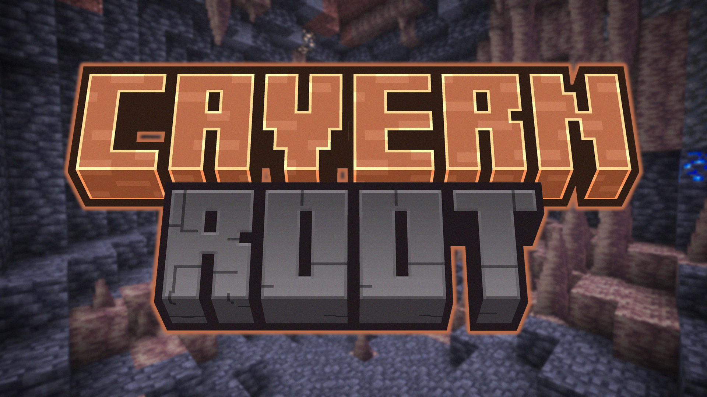

## 🫚 Description
Adds the **Cavern Root**. A new plant that spawns in caves and functions as extra food for starving players. With this mod, you will never have to stop mining because you run out of food!

## 📖 Features
1. **Cavern Root Block**. It _generates naturally_ in most caves. Does not spawn in lush caves as the Glow Berries are enough for that biome.
2. **Unwrapped Cavern Root**. Obtained by _breaking_ a Cavern Root Block, cannot be placed on the ground.
3. **Twisted Cavern Root**. _Crafted_ from a single Unwrapped Cavern Root. It is edible and gives 3 hunger (1.5 chicken icons).

### Expect improved versions!
